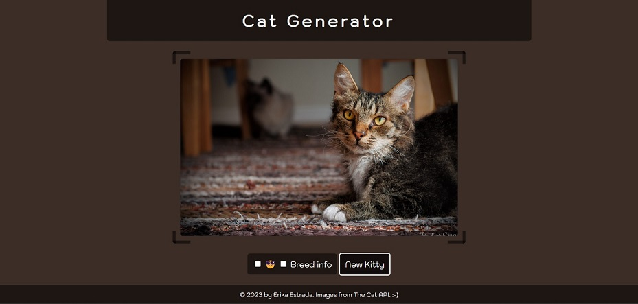

# Cat-Generator

This riveting, fascinating website shows you a picture of a cat. Click the "New Kitty" button to see a new cat. The images are fetched from The Cat API.

The background of the page changes with each image, matching the dominant color of each cat pic. This feature works by calling the SightEngine API.

### Setup

To make the webpage work locally, create a `.env` file at the root of the project. This file should contain the following:

    # https://thecatapi.com/
    CAT_KEY: "your_key_here"
    
    # https://sightengine.com/
    IMG_MOD_USER: "your_user_here"
    IMG_MOD_SECRET: "your_secret_here"

You will need to get API keys from [The Cat API](https://thecatapi.com/) and [SightEngine](https://sightengine.com/) and replace the placeholder values in your `.env` file with your own credentials.

To test the application, you can use [netlify-cli](https://docs.netlify.com/cli/get-started/). First, make sure your have [Node](https://nodejs.org/en/) installed. Then, run this command to install netlify-cli globally:

    npm install netlify-cli -g

From the project directory, run this command to start a local development server:

    netlify dev

If successful, the app will be running at `http://localhost:8888`.

## Future improvements

- When the daily limit of calls to the SightEngine API has been reached, the page stops updating with new images, getting stuck on the loader icon. This should be improved so that new cat images are still displayed even when the background color functionality isn't working.
- UI should be made responsive so it adjusts to different screen dimensions.
- Speed could be improved by reducing the amount of API calls.
- Because the images are made to cover a fixed width and height while retaining their original aspect ratio, sometimes a significant portion of the photo is cropped out (like the cat's head, or even the whole cat). This should be fixed to ensure the cat is always visible.
- **Debatable improvement:** Currently, checking "Breed info" only enables this feature for the next cat image. This feature should show the breed details of the currently displayed image as soon as the checkmark is selected.